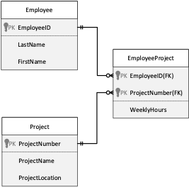

# Create Tables

## Instructions - DDL 1
1. Create a script that will create the following 3 tables:<br>
<br>
<ol type="a">
    <li>Use appropriate data types</li>
    <li>Do not worry about PKs or FKs</li>
    <li>Do not allow NULLs in any column</li>
    <li>EmployeeIDs are 11 characters long</li>
    <li>Use the IDENTITY property for the ProjectNumber in the Project table but not in the EmployeeProject table. (Why?)</li>
</ol>
2. List the table definition.
3. Save your script.

```sql

```

## Instructions - DDL 2
1. Modify the script that defines Employee, Project, and EmployeeProject tables to include the necessary PK constraint definitions.
2. Use the `SP_HELP` procedure to retrieve the definition.
3. Save your script.

```sql

```