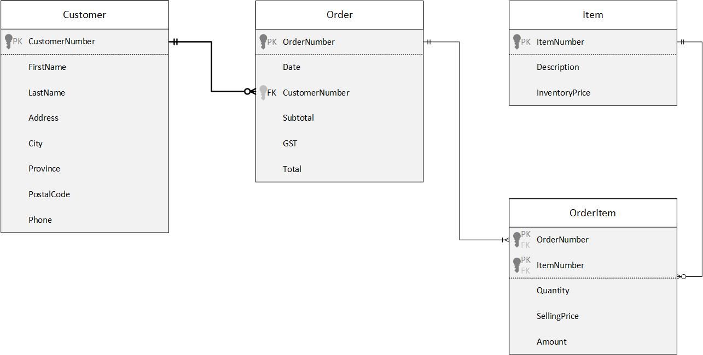

# ESP 1 - Normalization

## Customer Details View
### 0NF:
CustomerNumber,Name,Address,City,Province,PostalCode,HomePhone
### 1NF:
CustomerNumber,FirstName,LastName,Address,City,Province,PostalCode,HomePhone
### 2NF:
CustomerNumber,FirstName,LastName,Address,City,Province,PostalCode,HomePhone
### 3NF:
Customer: 
CustomerNumber,FirstName,LastName,Address,City,Province,PostalCode,HomePhone
## Customer Orders View
### 0NF:
Customer,CustomerNumber,Address,Phone,Date,OrderNumber(PK),(ItemNumber,Description,Quantity,Price,Amount),Subtotal,GST,Total
### 1NF:
**OrderNumber(PK)**,Date,FirstName,LastName,CustomerNumber,Address,City,Province,PostlCode,Phone,Subtotal,GST,Total

***OrderNumber(PK)(FK)***,**ItemNumber(PK)**,Description,Quantity,Price,Amount
### 2NF:
**OrderNumber(PK)**,Date,FirstName,LastName,CustomerNumber,Address,City,Province,PostlCode,Phone,Subtotal,GST,Total

***OrderNumber(PK)(FK)***,***ItemNumber(PK)(FK)***,Quantity,SellingPrice,Amount

**ItemNumber(PK)**,Description,InventoryPrice
### 3NF:
Order: 
**OrderNumber(PK)**,Date,_CustomerNumber(FK)_,Subtotal,GST,Total

Customer: 
**CustomerNumber(PK)**,FirstName,LastName,Address,City,Province,PostalCode,Phone

OrderItem: 
***OrderNumber(PK)(FK)***,***ItemNumber(PK)(FK)***,Quantity,SellingPrice,Amount

Item: 
**ItemNumber(PK)**,Description,InventoryPrice
## Merge:
Order: 
**OrderNumber(PK)**,Date,_CustomerNumber(FK)_,Subtotal,GST,Total

Customer: 
**CustomerNumber(PK)**,FirstName,LastName,Address,City,Province,PostalCode,Phone

OrderItem: 
***OrderNumber(PK)(FK)***,***ItemNumber(PK)(FK)***,Quantity,SellingPrice,Amount

Item: 
**ItemNumber(PK)**,Description,InventoryPrice

## Merged ERD

