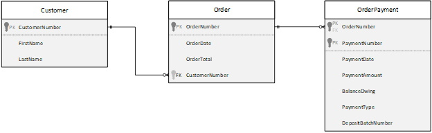
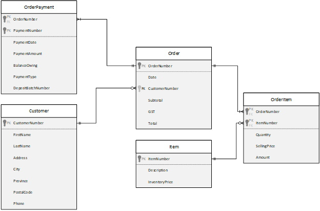

# ESP 2 - Normalization

## Payment Log View
### 0NF:
**OrderNumber(PK),CustomerName,CustomerNumber,OrderDate,OrderTotal,(PaymentDate,PaymentAmount,PaymentNumber,BalanceOwing,PaymentType,DepositBatchNumber)
### 1NF:
**OrderNumber(PK)**,FirstName,LastName,CustomerNumber,OrderDate,OrderTotal

***OrderNumber(FK)(PK)***,**PaymentNumber(PK)**,PaymentDate,PaymentAmount,BalanceOwing,PaymentType,DepositBatchNumber

### 2NF:
*OrderNumber(PK)**,FirstName,LastName,CustomerNumber,OrderDate,OrderTotal

***OrderNumber(FK)(PK)***,**PaymentNumber(PK)**,PaymentDate,PaymentAmount,BalanceOwing,PaymentType,DepositBatchNumbe
### 3NF:
Order: 
**OrderNumber(PK)**,OrderDate,OrderTotal,_CustomerNumber(FK)_

Customer: 
**CustomerNumber(PK)**,FirstName,LastName

OrderPayment: 
***OrderNumber(FK)(PK)***,**PaymentNumber(PK)**,PaymentDate,PaymentAmount,BalanceOwing,PaymentType,DepositBatchNumber

## Merge: ESP 1 + ESP 2
Order: 
**OrderNumber(PK)**,OrderDate,Subtotal,GST,OrderTotal,CustomerNumber(FK)

Customer: 
**CustomerNumber(PK)**,FirstName,LastName,Address,City,Province,PostalCode,Phone

OrderItem: 
OrderNumber(PK)(FK),ItemNumber(PK)(FK),Quantity,SellingPrice,Amount

Item: 
ItemNumber(PK),Description,InventoryPrice

OrderPayment: 
OrderNumber(FK)(PK),PaymentNumber(PK),PaymentDate,PaymentAmount,BalanceOwing,PaymentType,DepositBatchNumber

