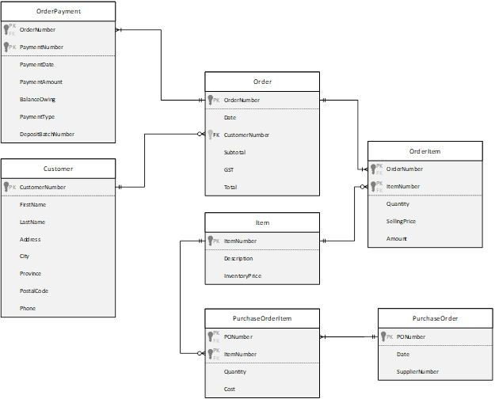
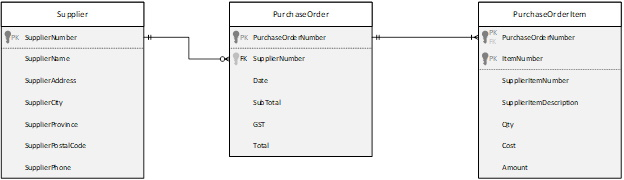
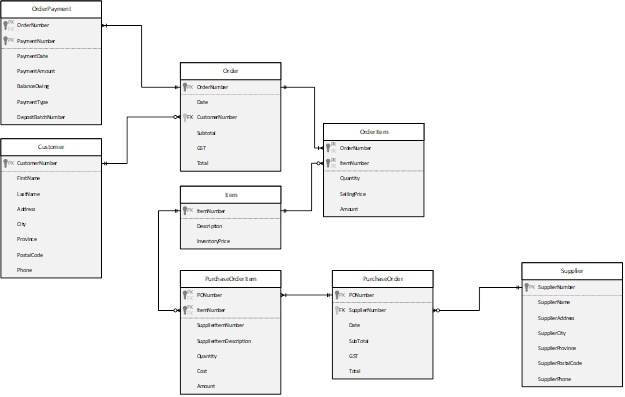

# ESP 3 - Normalization

## Inventory View
### 0NF:
**ItemNumber(PK)**,Description,CurrentPrice,(Date,SupplierNumber,PONumber,Quantity,Cost)
### 1NF:
**ItemNumber(PK)**,Description,CurrentPrice

***ItemNumber(FK)(PK)***,**PONumber(PK)**,Date,SupplierNumber,Quantity,Cost

### 2NF:
**ItemNumber(PK)**,Description,CurrentPrice

***ItemNumber(FK)(PK)***,***PONumber(PK)(FK)***,Quantity,Cost

**PONumber(PK)**,Date,SupplierNumber

### 3NF:
Item: 
**ItemNumber(PK)**,Description,CurrentPrice

PurchaseOrderItem: 
***ItemNumber(FK)(PK)***,***PONumber(PK)(FK)***,Quantity,Cost

PurchaseOrder: 
**PONumber(PK)**,Date,SupplierNumber

## Merge ESP1+2 with Inventory Control View
Order: 
**OrderNumber(PK)**,OrderDate,Subtotal,GST,OrderTotal,_CustomerNumber(FK)_

Customer: 
**CustomerNumber(PK)**,FirstName,LastName,Address,City,Province,PostalCode,Phone

OrderItem: 
***OrderNumber(PK)(FK)***,***ItemNumber(PK)(FK)***,Quantity,SellingPrice,Amount

PurchaseOrderItem: 
***ItemNumber(FK)(PK)***,***PONumber(PK)(FK)***,Quantity,Cost

Item: 
**ItemNumber(PK)**,Description,InventoryPrice

OrderPayment: 
***OrderNumber(FK)(PK)***,**PaymentNumber(PK)**,PaymentDate,PaymentAmount,BalanceOwing,PaymentType,DepositBatchNumber

PurchaseOrder: 
**PONumber(PK)**,Date,SupplierNumber

## Purchase Order View
### 0NF:
**PurchaseOrderNumber(PK)**,SupplierName,SupplierNumber,SupplierAddress,SupplierCity,SupplierPhone,Date,(ItemNumber,SupplierItemNumber,SupplierItemDescription,Qty,Cost,Amount),SubTotal,GST,Total
### 1NF:
**PurchaseOrderNumber(PK)**,SupplierName,SupplierNumber,SupplierAddress,SupplierCity,Supplierprovince,SupplierPostalCode,SupplierPhone,Date,SubTotal,GST,Total

***PurchaseOrderNumber(FK)(PK)***,**ItemNumber(PK)**,SupplierItemNumber,SupplierItemDescription,Qty,Cost,Amount

### 2NF:
**PurchaseOrderNumber(PK)**,SupplierName,SupplierNumber,SupplierAddress,SupplierCity,SupplierProvince,SupplierPostalCode,SupplierPhone,Date,SubTotal,GST,Total

***PurchaseOrderNumber(FK)(PK)***,**ItemNumber(PK)**,SupplierItemNumber,SupplierItemDescription,Qty,Cost,Amount

### 3NF:
PurchaseOrder: 
**PurchaseOrderNumber(PK)**,_SupplierNumber(FK)_,Date,SubTotal,GST,Total

Supplier: 
**SupplierNumber(PK)**,SupplierName,SupplierAddress,SupplierCity,SupplierProvince,SupplierPostalCode,SupplierPhone

PurchaseOrderItem: 
***PurchaseOrderNumber(FK)(PK)***,**ItemNumber(PK)**,SupplierItemNumber,SupplierItemDescription,Qty,Cost,Amount

## Merge: ESP1+2 + ESP 3
Order: 
**OrderNumber(PK)**,OrderDate,Subtotal,GST,OrderTotal,_CustomerNumber(FK)_

Customer: 
**CustomerNumber(PK)**,FirstName,LastName,Address,City,Province,PostalCode,Phone

OrderItem: 
***OrderNumber(PK)(FK)***,***ItemNumber(PK)(FK)***,Quantity,SellingPrice,Amount

PurchaseOrderItem: 
***PurchaseOrderNumber(FK)(PK)***,***ItemNumber(FK)(PK)***,SupplierItemNumber,SupplierItemDescription,Quantity,Cost,Amount

Item: 
**ItemNumber(PK)**,Description,InventoryPrice

OrderPayment: 
***OrderNumber(FK)(PK)***,**PaymentNumber(PK)**,PaymentDate,PaymentAmount,BalanceOwing,PaymentType,DepositBatchNumber

PurchaseOrder: 
**PONumber(PK)**,_SupplierNumber(FK)_,Date,SubTotal,GST,Total

Supplier: 
**SupplierNumber(PK)**,SupplierName,SupplierAddress,SupplierCity,SupplierProvince,SupplierPostalCode,SupplierPhone

