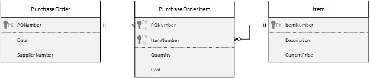

# ESP 3 - Normalization

## Inventory View
### 0NF:
**ItemNumber(PK)**,Description,CurrentPrice,(Date,SupplierNumber,PONumber,Quantity,Cost)
### 1NF:
**ItemNumber(PK)**,Description,CurrentPrice

***ItemNumber(FK)(PK)***,**PONumber(PK)**,Date,SupplierNumber,Quantity,Cost

### 2NF:
**ItemNumber(PK)**,Description,CurrentPrice

***ItemNumber(FK)(PK)***,***PONumber(PK)(FK)***,Quantity,Cost

**PONumber(PK)**,Date,SupplierNumber

### 3NF:
Item: 
**ItemNumber(PK)**,Description,CurrentPrice

PurchaseOrderItem: 
***ItemNumber(FK)(PK)***,***PONumber(PK)(FK)***,Quantity,Cost

PurchaseOrder: 
**PONumber(PK)**,Date,SupplierNumber

## Purchase Order View
### 0NF:

### 1NF:

### 2NF:

### 3NF:

## Merge: ESP1+2 + ESP 3
