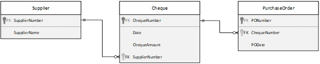
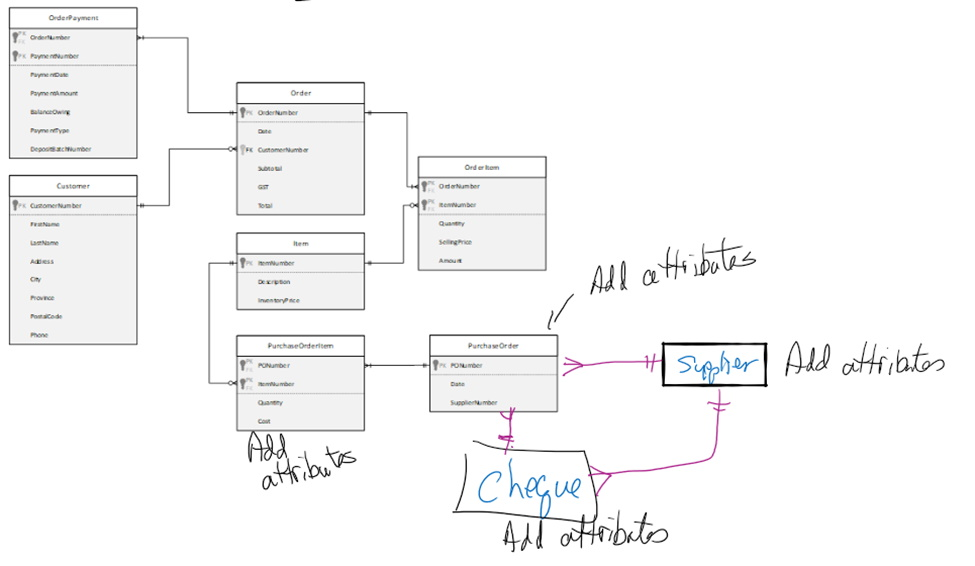

# ESP 4 - Normaliztion

## Cheque Register View
### 0NF:
0NF:
**ChequeNumber(PK)**,Date,ChequeAmount,SupplierNumber,SupplierName,(PONumber,PODate)

### 1NF:
**ChequeNumber(PK)**,Date,ChequeAmount,SupplerNumber,SupplierName

**PONumber(PK)**,_ChequeNumber(FK)_,PODate

### 2NF:
**ChequeNumber(PK)**,Date,ChequeAmount,SupplerNumber,SupplierName

**PONumber(PK)**,_ChequeNumber(FK)_,PODate
### 3NF:
Cheque: 
**ChequeNumber(PK)**,Date,ChequeAmount,_SupplerNumber(FK)_

Supplier: 
**SupplerNumber(PK)**,SupplierName

PurchaseOrder: 
**PONumber(PK)**,_ChequeNumber(FK)_,PODate

## Merge: ESP1+2+3 + ESP 4
_Complete the final merge with the knowledge you gained._

_Complete the final ERD with the knowledge you have so far._

