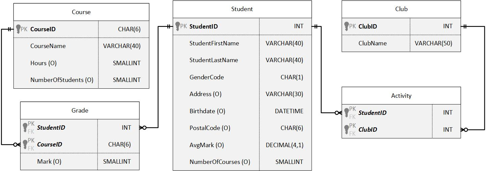

# Create Table Exercise
Given the following ERD, create all 5 tables with the appropriate primary and foreign keys. Include Check constraints and Defaults on the appropriate columns.


| COLUMN NAME | DOMAIN LIMIT(S) | REQUIRED |
|-------------|-----------------| :----:|
| StudentID |  | YES |
| StudentFirstName |  | YES |
| StudentLastName |  | YES |
| GenderCode | 'F' or 'M' | YES |
| Address |  | NO |
| Birthdate |  | NO |
| PostalCode | A9A9A9 | NO
| AvgMark | Between 0 and 100 | NO | 
| NumberOfCourses | >=0, Default = 0 | NO |
|   |   |  |
| CourseID |   | YES |
| CourseName |   | YES |
| Hours | >0 | NO |
| NumberOfStudents | >=0 | NO |
|   |   |  |
| ClubID |  | YES |
| ClubName |  | YES |
|   |   |  |
| StudentID |  | YES |
| CourseID |  | YES |
| Mark | Between 0 and 100, Default = 0 | NO |
|   |   |  |
| StudentID |   | YES |
| ClubID |  | YES |

## Solution
```sql

```