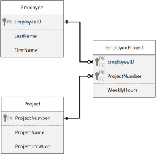

# Create Tables

## Instructions - DDL 1
1. Create a script that will create the following 3 tables:<br>
<br>
<ol type="a">
    <li>Use appropriate data types</li>
    <li>Do not worry about PKs or FKs</li>
    <li>Do not allow NULLs in any column</li>
    <li>EmployeeIDs are 11 characters long</li>
    <li>Use the IDENTITY property for the ProjectNumber in the Project table but not in the EmployeeProject table. (Why?)</li>
</ol>
2. List the table definition.
3. Save your script.

```sql
-- Select the database to use
USE Sample
GO

-- Drop tables
DROP TABLE EmployeeProject
DROP TABLE Project
DROP TABLE Employee
GO

-- Create tables
CREATE TABLE Employee(
  EmployeeID       CHAR(11)             NOT NULL,
  LastName         VARCHAR(60)          NOT NULL,
  FirstName        VARCHAR(60)          NOT NULL
)

CREATE TABLE Project(
  ProjectNumber    INT IDENTITY(1,1)    NOT NULL,
  ProjectName      VARCHAR(60)          NOT NULL,
  ProjectLocation  VARCHAR(100)         NOT NULL	
)

CREATE TABLE EmployeeProject(
  EmployeeID       CHAR(11)             NOT NULL,
  ProjectNumber    INT                  NOT NULL,
  WeeklyHours      TINYINT              NOT NULL
)
GO -- end of a batch
```

## Instructions - DDL 2
1. Modify the script that defines Employee, Project, and EmployeeProject tables to include the necessary PK constraint definitions.
2. Use the `SP_HELP` procedure to retrieve the definition.
3. Save your script.

```sql
-- Select the database to use
USE Sample
GO

-- Drop tables
DROP TABLE EmployeeProject
DROP TABLE Project
DROP TABLE Employee
GO

-- Create tables
CREATE TABLE Employee(
  EmployeeID       CHAR(11)             NOT NULL
    CONSTRAINT PK_Employee_EmployeeID PRIMARY KEY CLUSTERED,
  LastName         VARCHAR(60)          NOT NULL,
  FirstName        VARCHAR(60)          NOT NULL
)

CREATE TABLE Project(
  ProjectNumber    INT IDENTITY(1,1)    NOT NULL
    CONSTRAINT PK_Project_ProjectNumber PRIMARY KEY CLUSTERED,
  ProjectName      VARCHAR(60)          NOT NULL,
  ProjectLocation  VARCHAR(100)         NOT NULL	
)

CREATE TABLE EmployeeProject(
  EmployeeID       CHAR(11)             NOT NULL,
  ProjectNumber    INT                  NOT NULL,
  WeeklyHours      TINYINT              NOT NULL,
  CONSTRAINT PK_EmployeeProject_EmployeeID_ProjectNumber PRIMARY KEY CLUSTERED(EmployeeID,ProjectNumber)
)
GO -- end of a batch
```

## Create Table Exercise Solution
```sql

```