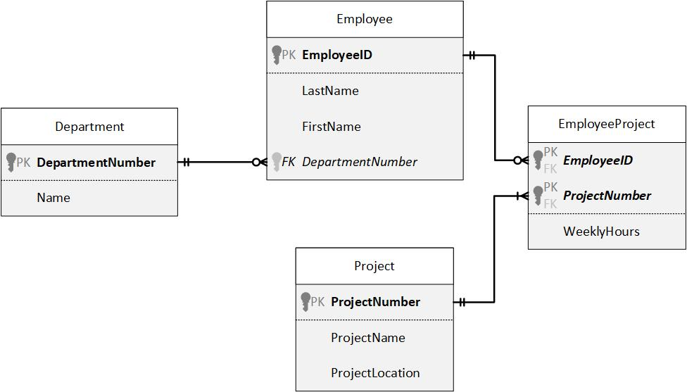

# Foreign Key Constraints

## Instructions - DDL 3

1. Modify the script that contains the Employee, Project, and EmployeeProject tables to include the necessaey `FOREIGN KEY CONSTRAINT` definitions.
2. Create the Department table as a stand-alone table for now (no relationships to other tables). Use the `IDENTITY` property for the DepartmentNumber.
3. How would you create a `1:M` relationship between Department and Employee?



```sql
-- Select the database to use
USE Sample
GO

-- Drop tables
DROP TABLE EmployeeProject
DROP TABLE Project
DROP TABLE Employee
DROP TABLE Department
GO

-- Create tables
CREATE TABLE Department(
	DepartmentNumber	INT IDENTITY(1,1)	NOT NULL
		CONSTRAINT PK_Department_DepartmentNumber PRIMARY KEY CLUSTERED,
	Name				VARCHAR(40)			NOT NULL
)

CREATE TABLE Employee(
	EmployeeID		CHAR(11)			NOT NULL
		CONSTRAINT PK_Employee_EmployeeID PRIMARY KEY CLUSTERED,
	LastName		VARCHAR(60)			NOT NULL,
	FirstName		VARCHAR(60)			NOT NULL,
	DepartmentNumber	INT				NOT NULL
		CONSTRAINT FK_Employee_DepartmentNumber FOREIGN KEY REFERENCES Department(DepartmentNumber)
)

CREATE TABLE Project(
	ProjectNumber	INT IDENTITY(1,1)	NOT NULL
		CONSTRAINT PK_Project_ProjectNumber PRIMARY KEY CLUSTERED,
	ProjectName		VARCHAR(60)			NOT NULL,
	ProjectLocation	VARCHAR(100)		NOT NULL	
)

CREATE TABLE EmployeeProject(
	EmployeeID		CHAR(11)			NOT NULL
		CONSTRAINT FK_EmployeeProject_EmployeeID FOREIGN KEY REFERENCES Employee(EmployeeID),
	ProjectNumber	INT					NOT NULL
		CONSTRAINT FK_EmployeeProject_ProjectNumber FOREIGN KEY REFERENCES Project(ProjectNumber),
	WeeklyHours		TINYINT				NOT NULL
		CONSTRAINT CK_EmployeeProject_WeeklyHours CHECK (WeeklyHours <= 20)
		CONSTRAINT DF_EmployeeProject_WeeklyHours DEFAULT 5,
	CONSTRAINT PK_EmployeeProject_EmployeeID_ProjectNumber PRIMARY KEY CLUSTERED(EmployeeID,ProjectNumber)
)
-- GO -- end of a batch
```