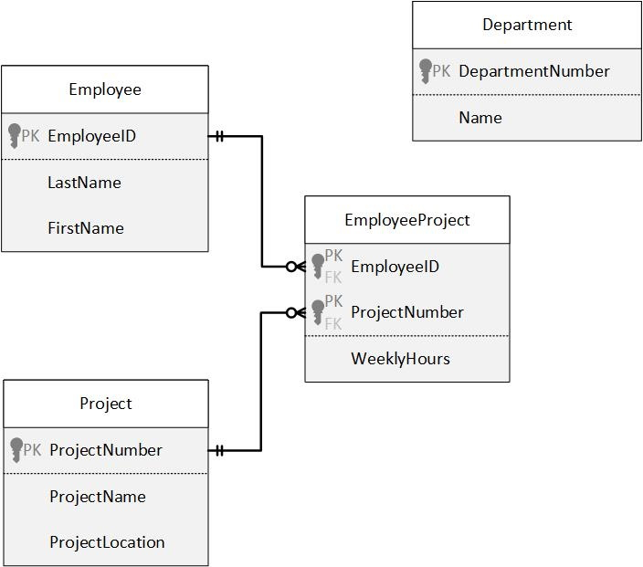

# Foreign Key Constraints

## Instructions - DDL 3

1. Modify the script that contains the Employee, Project, and EmployeeProject tables to include the necessaey `FOREIGN KEY CONSTRAINT` definitions.
2. Create the Department table as a stand-alone table for now (no relationships to other tables). Use the `IDENTITY` property for the DepartmentNumber.
3. How would you create a `1:M` relationship between Department and Employee?

```sql

```

## Create Table Exercise - FK Constraints
```sql

```