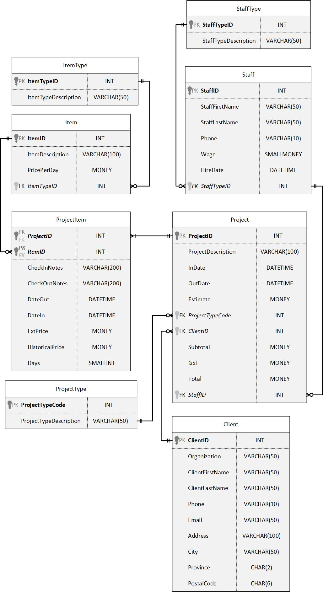

# DML - INSERT
## Sample Code
```sql
-- insert a new Staff member
INSERT INTO Staff (FirstName,LastName,DateHired,DateReleased,PositionID,LoginID)
VALUES('Jason','Teachalot','Jan 1 2013',NULL,4,NULL)
GO
```

This `INSERT` gives the following error message:<br>
`Cannot insert the value NULL into column 'StaffID', table 'IQSchool.dbo.Staff'; column does not allow nulls. INSERT fails.`<br>
The error is due to trying to INSERT a NULL into the StaffID column; this column is not defined as an `IDENTITY` column. Changing the script to that shown below will enable the INSERT to complete successfully.

```sql
INSERT INTO Staff (StaffID,FirstName,LastName,DateHired,DateReleased,PositionID,LoginID)
VALUES(11,'Jason','Teachalot','Jan 1 2013',NULL,4,NULL)
GO
```

## INSERT EXERCISE


Use the **Memories Forever** database for this exercise.The current solution has the script to create it if you have not competed the create tables exercise. If an insert fails write a brief explanation why. Do not just quote the error message genereated by the server!

1. Add the following records into the ItemType Table:<br>

| **ItemTypeID** | **ItemTypeDescription** |
|----------------|-------------------------|
| 1 | Camera |
| 2 | Lights |
| 3 | Stand |
| 2 | Backdrop |
| 89899985225 | Outfit |
| 4A | Other |

```sql

```

2. Add the following records into the Item Table:<br>

| **ItemID** | **ItemDescription** | **PricePerDay** | **ItemTypeID** |
|------------|---------------------|-----------------|----------------|
|  | Canon G2 | 25 | 1 |
|  | 100W tungston | 18 | 2 |
|  | Super Flash | 25 | 4 |
|  | Canon EOS20D | 30 | 1 |
| 5 | HP 630 | 25 | 1 |
|  | Light Holdomatic | 22 | 3 |

```sql

```

3. Add the following records into the StaffType Table: <br>

| **StaffTypeID** | **StaffTypeDescription** |
|-----------------|--------------------------|
| 1 | Videographer |
| 2 | Photographer |
| 1 | Mixer |
|  | Sales |
| 3 | Sales |

```sql

```

4. Add the following records into the Staff Table:<br>

| **StaffID** | **StaffFirstName** | **StaffLastName** | **Phone** | **Wage** | **HireDate** | **StaffTypeID** |
|-------------|--------------------|-------------------|-----------|----------|--------------|-----------------|
| 1 | Joe | Cool | 5551223212 | 23 | Jan 1 2007 | 1 |
| 1 | Joe | Cool | 5551223212 | 23 | Nov 2 2021  | 1 |
| 2 | Sue | Photo | 5556676612 | 15 | Nov 2 2021  | 3 |
| 3 | Jason | Pic | 3332342123 | 23 |Nov 2 2021  | 2 |

```sql

```