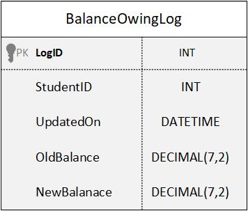

# Triggers - Practice Questions
## Practice Q #1
Create a trigger associated with an UPDATE to `Student.Balance`. It will:
1. Issue an informational message to indicate the trigger is executing
    1. display the contents of the **`INSERTED` table**
    2. display the contents of the **`DELETED` table**
    3. display the contents of the **Base table**
2. Issue a `ROLLBACK TRANSACTION`
    1. display the contents of the **`INSERTED` table after the `ROLLBACK`**
    2. display the contents of the **`DELETED` table after the `ROLLBACK`**
    3. display the contents of the **base table after the `ROLLBACK`**
3. Issue an informational message to indicate the completion of the trigger

```sql

```

### How to test
To test:
1. Issue an update to the `BalanceOwing` column that **violates the data type** of the column being updated.
2. Issue a valid update to the `BalanceOwing` that affects **one row**.
3. Issue a valid update to the `BalanceOwing` that affects **multiple rows**.
4. Issue a valid update to the `BalanceOwing` that affects **zero rows**.

```sql

```


## Practice Q #2
Create a trigger to enforce a rule that **`CharacterWages` must be >= 0**.

```sql

```

## Practice Q #3
Create a trigger that enforces a rule that an **`AgentFee` cannot be increased by more than 100% in one update**.

e.g., if the AgentFee was $100, I cannot update it to a value greater than $200.

```sql

```

## Practice Q #4
Create a trigger that enforces a rule that a **`MovieCharacter` cannot be deleted if their Agent's AgentFee is >= 50**.

```sql

```

## Practice Q #5
Create a trigger that enforces a rule that an **`Agent` cannot represent more than 2 movie characters**.

```sql

```

## Practice Q #6
Create a trigger to **Log when changes are made to the `CourseCost`** in the Course table. The changes will be inserted in to the following Logging table:<br>


```sql
CREATE TABLE CourseChanges(
	LogID 		INT IDENTITY(1,1)	NOT NULL
	    CONSTRAINT PK_CourseChanges PRIMARY KEY CLUSTERED,
	ChangeDate 	DATETIME 		    NOT NULL,
	OldCourseCost 	MONEY 		    NOT NULL,
	NewCourseCost 	MONEY 		    NOT NULL,
	CourseID 		CHAR(7) 	    NOT NULL
)
```

```sql

```

## Triggers Exercise
(Use IQSchool DB)
**NOTE**: These questions are not in order of increasing difficulty.
1. To be fair to all students, a student can only belong to a maximum of 3 clubs. Create a trigger to enforce this rule.<br>

```sql

```

2. The Education Board is concerned with rising course costs! Create a trigger to ensure that a course cost does not get increased by more than 20% at any one time.<br>

```sql

```

3. Too many students owe us money and keep registering for more courses! Create a trigger to ensure that a student cannot register for any more courses if they have a balance owing of >$500.<br>

```sql

```

4. Our school DBA has suddenly become allergic to Foreign Key constraints and has disabled them in the database! Create a trigger on the Registration table to ensure that only valid StudentID’s and OfferingCode’s are used for Registration records. Try and have the trigger raise an error for each foreign key that is not valid. If you have trouble with this question create the trigger so it just checks for a valid StudentID.<br>

```sql

```

5. Contrary to the advice of the school doctor, the DBA still thinks he is allergic to Foreign Key constraints! Yikes! Create a trigger on the Student table that will ensure that we do not delete any students that have made payments, have Registration records, or belong to any clubs.<br>

```sql

```

6. Not only has the school DBA come down with some mysterious allergy but our network security officer suspects our system has a virus that is allowing students to alter their Balance Owing! To track down what is happening, we want to create a logging table that will log any changes to the BalanceOwing in the student table. You must create the logging table and the trigger to populate it when a balance owing is updated.<br>
<br>


```sql

```

7. We have learned it is a bad idea to update primary keys. Yet someone keeps trying to update the Club tables ClubID column and the Course tables CourseID column! Create triggers to stop this from happening! You are authorized to use whatever force is necessary! Well, in your triggers, anyways!<br>

```sql

```
